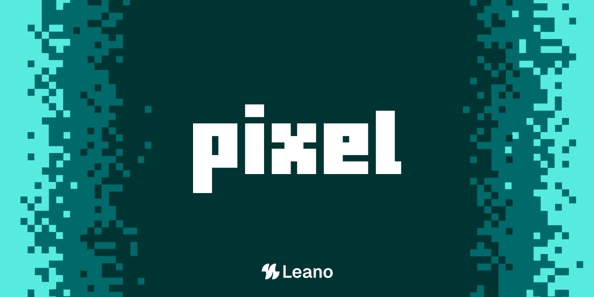

<p align="center">
  
</p>

<p align="center">
  <a href="https://www.npmjs.com/package/pixel-cli"></a>
  <a href="https://www.npmjs.com/package/pixel-cli"></a>
  <a href="LICENSE"></a>
  <a href="https://nodejs.org"></a>
  <a href="https://github.com/leanojs/pixel"></a>
</p>

<p align="center">
  Optimize a folder of images in one command.<br />
  Format-preserving by default · directory structure mirrored · originals untouched unless you ask.
</p>

```bash
npx pixel-cli optimize ./public
```

```
$ pixel optimize ./public

Scanning ./public... 340 images found (png, jpeg, webp)

optimizing [====================>] 340/340

  public/img/hero.png          842 KB → 210 KB   (-75%)
  public/img/icons/logo.svg    skipped (unsupported format)
  public/blog/2024/cover.jpg   1.2 MB → 380 KB   (-68%)
  ...

Done. 338 optimized, 2 skipped.
Total: 84.3 MB → 21.6 MB  (74% smaller)
Output written to ./public-optimized  (originals untouched)
```

Point it at a real Next.js / Astro / whatever `public/` folder. No config
file, no account, no setup.

## Install

```bash
# one-shot
npx pixel-cli optimize ./public

# or global (bin is `pixel`)
npm install -g pixel-cli
pixel optimize ./public
```

## Usage

```bash
pixel optimize <input> [options]
```

`<input>` can be a single image or a directory.

| Flag | Description |
| --- | --- |
| `-o, --out <dir>` | Output directory (default: `<input>-optimized`) |
| `--in-place` | Overwrite files in `<input>` directly |
| `-f, --format <fmt>` | Convert to `png`, `jpeg`, or `webp` (default: preserve) |
| `-q, --quality <n>` | Quality override (default: `80`) |
| `--width <n>` | Resize to width, aspect ratio preserved |
| `--dry-run` | Report projected savings, write nothing |
| `--concurrency <n>` | Parallel file limit (default: `4`) |

### Examples

```bash
# Safe default — writes ./public-optimized
pixel optimize ./public

# Preview savings without writing
pixel optimize ./public --dry-run

# Overwrite the source tree (explicit opt-in)
pixel optimize ./public --in-place

# Single file
pixel optimize ./hero.png

# Convert a folder to WebP
pixel optimize ./public -f webp -o ./public-webp
```

## Behavior

- **Safe by default.** Output goes to `<input>-optimized`. Use `--in-place`
  only when you mean it.
- **Format-preserving.** `optimize` never changes format unless you pass
  `--format`.
- **Skip, don't fail.** SVG, ICO, and other unsupported files are reported
  and skipped; the rest of the run continues.
- **Supported formats:** PNG, JPEG, WebP.

## Develop

```bash
pnpm install
pnpm build
pnpm test
pnpm pixel optimize ./path/to/images
```

Monorepo packages:

- `@pixel/core` — optimize engine
- `pixel-cli` — CLI (`pixel` binary)

## License

Apache-2.0
